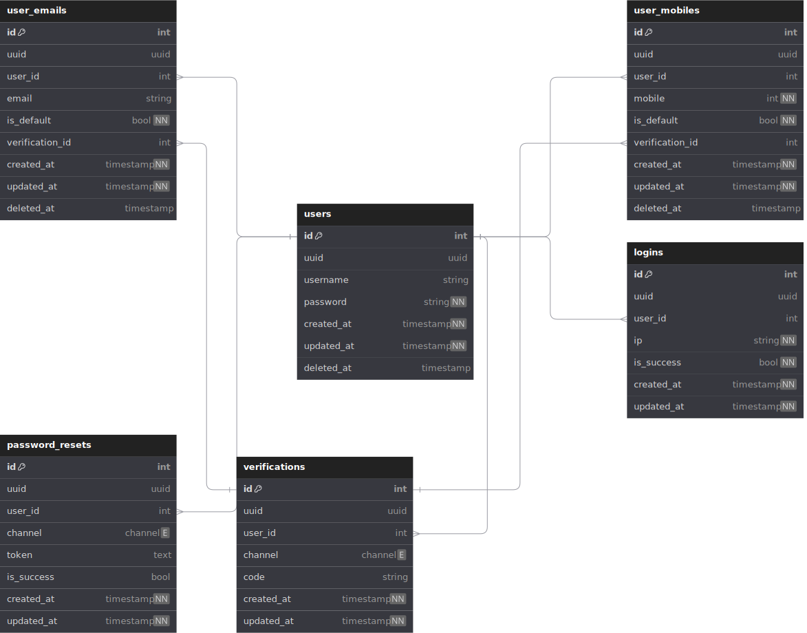

# Authentication Service
## Description
This service handles authentication functionalities contains Sign-up, Sing-in, Forgot Password
## Features
- [ ] Sign-up
- [ ] Sign-in
- [ ] Forgot Password
## Database
### DBML (Database Markup Language)
> [File](./Assets/database.dbml)
### Diagram

  
Show

